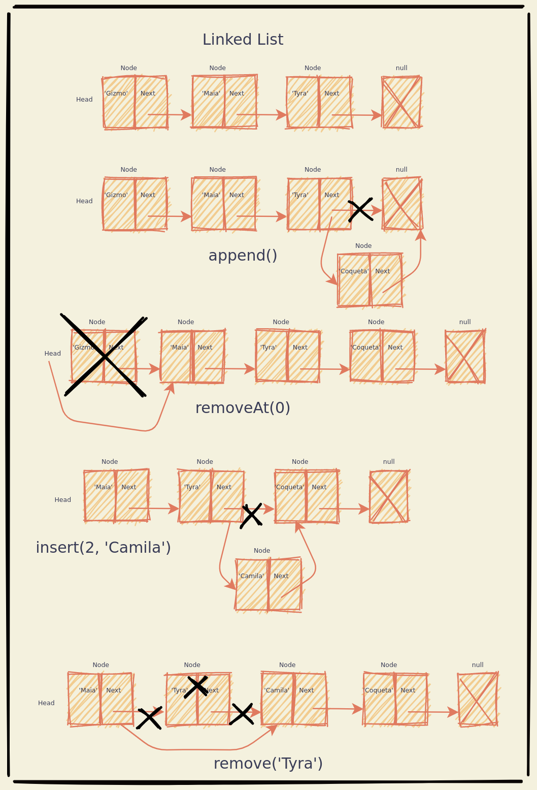

# Linked Lists

Simple Data Structure that sotres a sequence of data. Unlike Arrays, the Linked
List's elements aren't placed contiguosly in memory.

Each element is going to be called a 'Node'. A Node stores the element itslef
and also a pointer to the next element.

## Node
Attributes | Methods
---------- | -------
item | .
next | .

## Linked List
Attributes | Methods [ name(parameters) : return ]
---------- | -------
head | size() : int
length | isEmpty() : bool
. | getHead() : Node
. | append(item) : String | bool
. | removeAt(position) : String | bool
. | remove(item) : String | bool
. | insert(position, item) : String | bool
. | indexOf(item) : int
. | toString() : String

