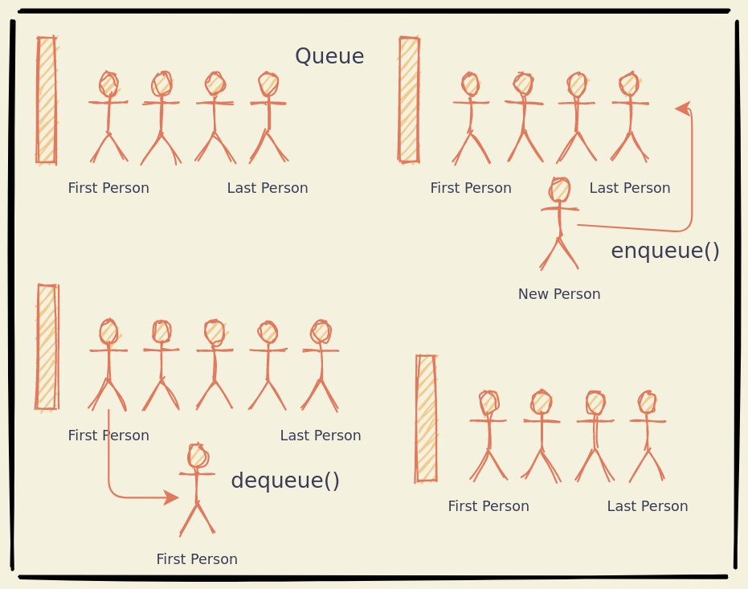

# Queue

Queues are Abstract Data Structures that follows the FIFO principle. First In
First Out.

Queues can have the following proporties:
Attributes | Methods [ name(parameters) : return ]
---------- | -------
items[] | size() : int
. | isEmpty() : bool
. | enqueue() : items[]
. | dequeue() : item
. | front() : item
. | print() : string

