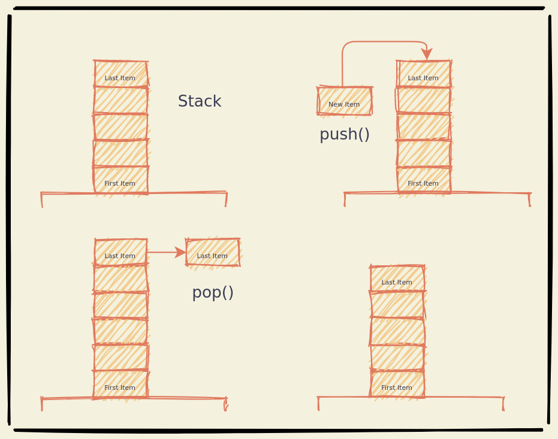

# Stack

Stacks are Abstract Data Structures that follows the LIFO principle. Last In
First Out.

Stacks can have the following proporties:
Attributes | Methods [ name(parameters) : return ]
---------- | -------
items[] | size() : int
. | isEmpty() : bool
. | push() : items[]
. | pop() : item
. | peek() : item
. | clear() : items[]
. | toString() : string

